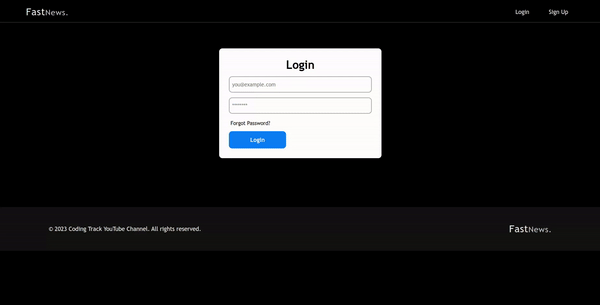

# FastNews 📰

I have created a news website using React.js with Vite framework for the frontend, Node.js for the backend, and styled-components for styling.

## Tools 🛠️
- Frontend: React with Vite framework ⚛️
- Backend: Node.js 🟩
- Database: MongoDB 🍃
- ORM: Mongoose 🐍
- Email: Nodemailer 📧

## Features ✨

- 🔑 Login
- 📝 Signup
- 🚪 Logout
- ❌ Delete Account
- ✉️ Update email, name, role
-🔒 Change password
- 📰 Create Post
- 🗑️ Delete Post
- 🔑 Admin and User role functionality

## Functionality ⚙️
- Users can login, signup, logout, and delete their accounts.
- Users signed up as "admin" can create and delete posts.
- All users can view all posts.
- Admins can view posts they created.
- Regular users can see all posts but cannot create or delete posts.
- All users can update their email, name, role, password, and delete their account.
- Users receive an email notification when they signup, update their email, name, role, or password, delete their account, create a post, or delete a post.

## Tech Stack 🛠️

- React
- Node.js

## OUTPUT 🖥️

